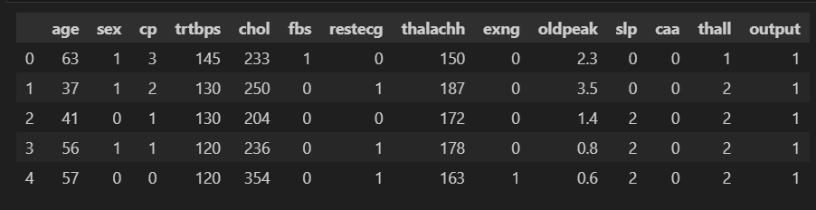
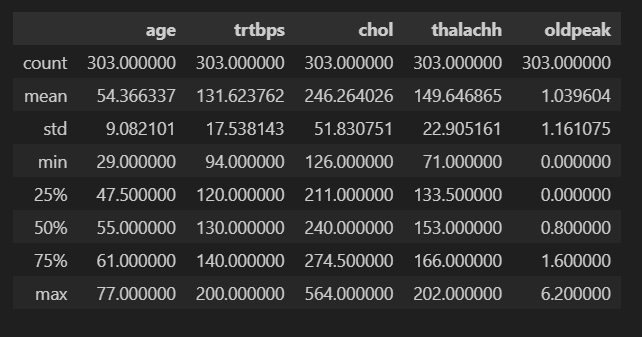
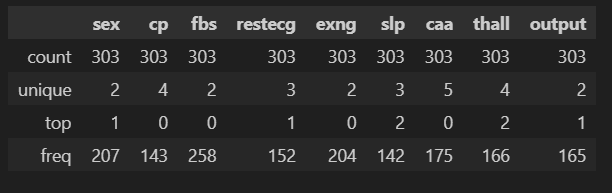
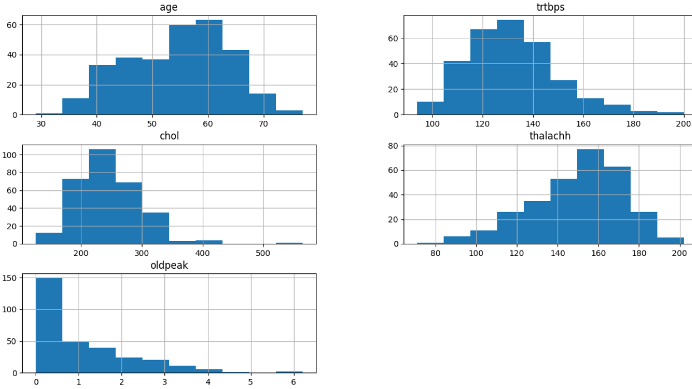
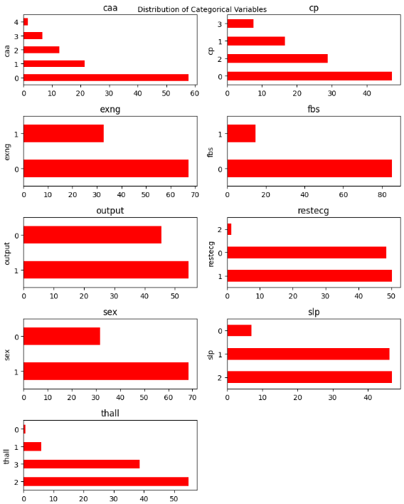
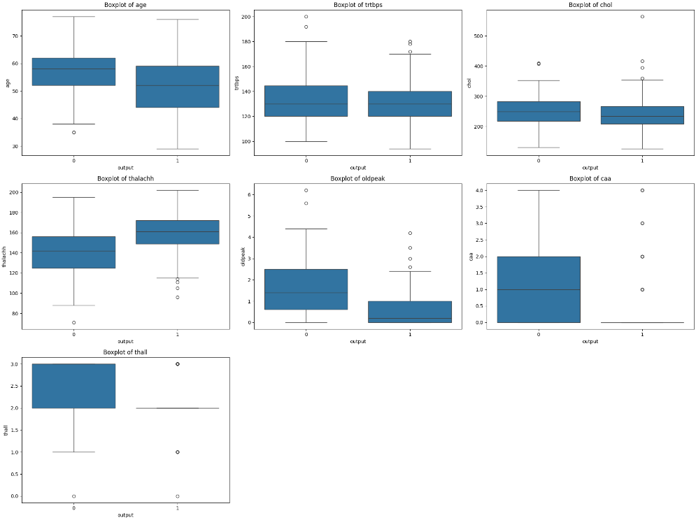
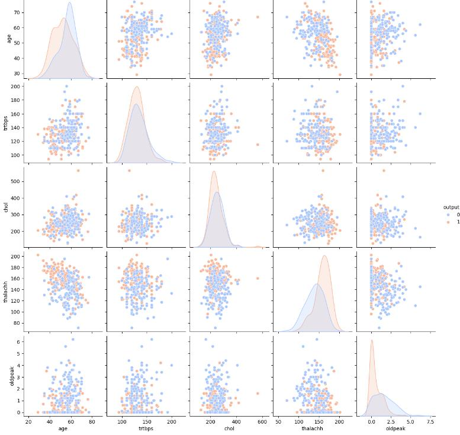
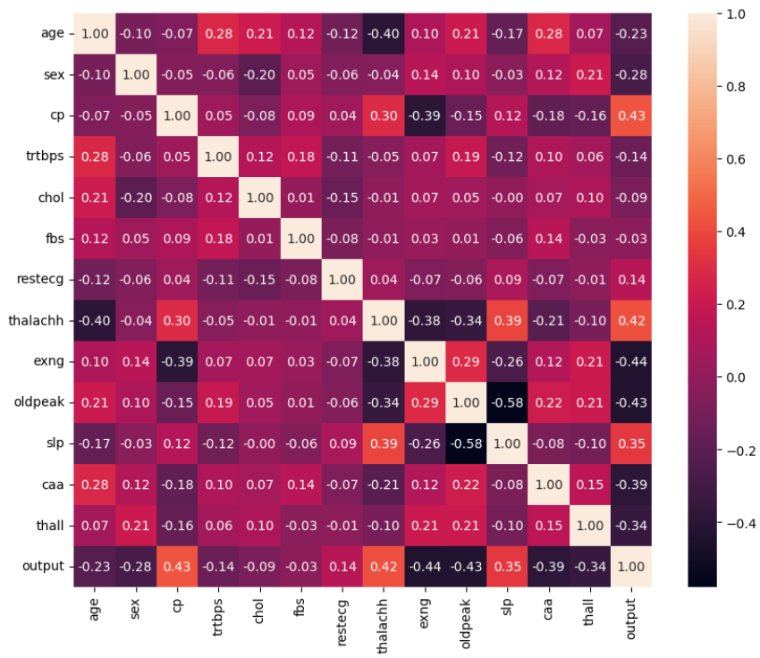
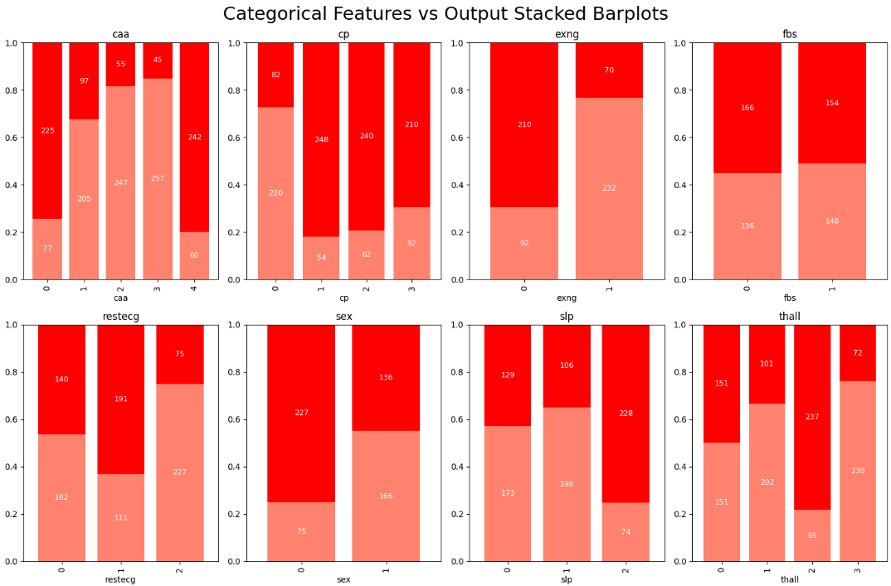
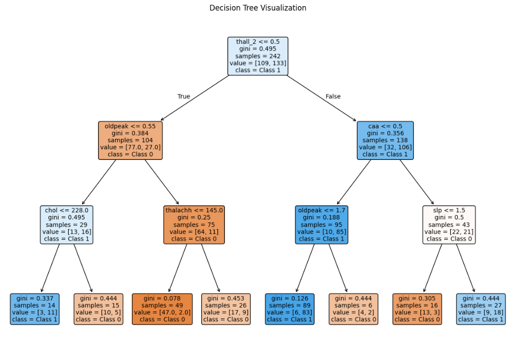

# Heart Disease Prediction

**Supervisor:** Dr. Hoori Razavi
**Author:** Reyhane Bonyady
**Term:** Fall 2024

## Introduction

In this project, we examine a dataset containing various health indicators of cardiac patients, such as age, blood pressure, heart rate, and more. Our goal is to build a predictive model capable of accurately identifying individuals with heart disease. Given the serious consequences of missing a positive diagnosis, our main focus is on making sure the model identifies as many potential patients as possible (i.e., maximizing recall for the positive class).

## Data Description

| Variable | Description |
|---|---|
| `age` | Patient's age in years |
| `sex` | Patient's sex (0 = male, 1 = female) |
| `cp` | Chest pain type: 0 = typical angina, 1 = atypical angina, 2 = non-anginal pain, 3 = asymptomatic |
| `trestbps` | Resting blood pressure (mm Hg) |
| `chol` | Cholesterol (mg/dl) |
| `fbs` | Fasting blood sugar (1 if > 120 mg/dl, else 0) |
| `restecg` | Resting electrocardiogram results: 0 = normal, 1 = ST-T wave abnormality, 2 = probable or definite left ventricular hypertrophy |
| `thalach` | Maximum heart rate achieved during the stress test |
| `exang` | Exercise-induced angina (1 = yes, 0 = no) |
| `oldpeak` | ST depression induced by exercise relative to rest |
| `slope` | Slope of the peak exercise ST segment: 0 = upsloping, 1 = flat, 2 = downsloping |
| `ca` | Number of major vessels (0-4) colored by fluoroscopy |
| `thal` | Thallium stress test result: 0 = normal, 1 = fixed defect, 2 = reversible defect, 3 = not described |
| `output` | Heart disease status (0 = no disease, 1 = disease present) |



## Preprocessing

- **Rows:** 303
- **Columns:** 14, covering patient characteristics and test results
- **Data types:** 13 of 14 columns are `int64`; only `oldpeak` is `float64`
- **Missing values:** none

> **Note:** Based on the data types and feature descriptions above, 9 columns (`sex`, `cp`, `fbs`, `restecg`, `exang`, `slope`, `ca`, `thal`, `target`) are numeric in type but categorical in meaning. These features need to be converted to the appropriate (categorical/object) type for correct analysis and interpretation.

## Statistical Summary





**Continuous features**
- `age`: mean ≈ 54.4 years, ranging from 29 to 77
- `trestbps`: mean ≈ 131.62 mmHg, ranging from 94 to 200
- `chol`: mean ≈ 246.26 mg/dl, ranging from 126 to 564
- `thalach`: mean ≈ 149.65, ranging from 71 to 202
- `oldpeak`: mean ≈ 1.04, ranging from 0 to 6.2

**Discrete features**
- `sex`: 2 unique values; female (1) is the most common, appearing 207/303 times
- `cp`: 4 unique chest pain types; type "0" is most common (143 occurrences)
- `fbs`: 2 categories; "0" (fasting blood sugar < 120 mg/dl) is most common (258 occurrences)
- `restecg`: 3 unique results; "1" is most common (152 occurrences)
- `exang`: 2 unique values; "0" (no exercise-induced angina) is most common (204 occurrences)
- `slope`: 3 unique slopes; "2" is most common (142 occurrences)
- `ca`: 5 unique values; "0" is most common (175 occurrences)
- `thal`: 4 unique results; "2" (reversible defect) is most common (166 occurrences)
- `output`: "1" (heart disease present) is most common (165 occurrences)

## Continuous Feature Histograms



- **Age:** The distribution is fairly uniform, with a peak in the late 50s.
- **Resting blood pressure:** Most patients sit around 120-140 mmHg.
- **Cholesterol:** Most patients' cholesterol is between 200 and 300 mg/dl.
- **Max heart rate:** Most patients reach between 140 and 170 bpm during the stress test.
- **Oldpeak (exercise-induced ST depression):** Most values cluster around 0, meaning many patients did not experience significant ST depression during exercise.

After reviewing the histograms of the continuous features, there doesn't appear to be any significant noise or unacceptable values among them.

## Discrete Feature Distribution



- **Sex:** The dataset is predominantly female, who make up a significant majority.
- **Chest pain type (cp):** The dataset shows different chest pain types among patients; type 0 (typical angina) appears to be the most common.
- **Fasting blood sugar (fbs):** A significant majority of patients have fasting blood sugar below 120 mg/dl, indicating high blood sugar is not a common condition in this dataset.
- **Resting ECG (restecg):** Results vary, with certain types more common than others.
- **Exercise-induced angina (exang):** Most patients do not experience exercise-induced angina, suggesting it may not be a common symptom among the patients in this dataset.
- **Slope of peak ST segment (slope):** The dataset shows different slopes; one type may be more common, as seen in the bar charts.
- **Major vessels colored by fluoroscopy (ca):** Most patients have fewer major vessels colored by fluoroscopy, with zero being the most frequent value.
- **Thallium stress test result (thal):** A particular type appears more common, as seen in the charts.

## Boxplot Analysis of Continuous Variables



- **Age:** The age distribution between patients with heart disease (output = 1) and without (output = 0) doesn't differ significantly. The median age is close for both groups, suggesting age alone isn't a strong indicator of heart disease in this data.
- **Resting blood pressure (trestbps):** Similar for both groups, with slightly higher values in the no-disease group. Outliers in both groups indicate some individuals with high blood pressure.
- **Cholesterol (chol):** Similar in both groups, with considerable overlap in the IQR. Outliers in both groups suggest cholesterol alone can't strongly distinguish between patients with and without heart disease.
- **Max heart rate (thalach):** Patients with heart disease (output = 1) generally have a lower max heart rate than those without. Fewer outliers appear in the no-disease group.
- **Oldpeak:** Patients with heart disease show less exercise-induced ST depression than those without. The difference in median and IQR suggests this feature **can** be a distinguishing factor for heart disease.
- **Major vessels (ca):** Patients without heart disease tend to have a higher count of major vessels colored by fluoroscopy. Outliers and lower values in diseased patients **indicate this feature's importance** for distinguishing between the groups.
- **Thallium stress test (thal):** The distribution differs between the two groups; patients without heart disease tend to have higher values here, indicating better test results. The IQRs overlap less, suggesting **this feature could be important** for distinguishing between groups.

**Key distinguishing features:** `thalach`, `oldpeak`, `ca`, and `thal` show larger differences between groups and are likely more important for predicting heart disease.

**Overlapping features:** `age`, `chol`, and `trestbps` overlap significantly and don't have strong predictive power on their own.

## Scatterplot Analysis of Continuous Features



- **Age:** The age distribution between the two groups overlaps considerably. Patients with heart disease (orange points) are generally concentrated slightly higher in age, but the difference is minor.
- **Resting blood pressure (trestbps):** Data overlaps significantly between groups; on its own, this feature doesn't create a clear distinction between the two groups.
- **Cholesterol (chol):** Also shows significant overlap. High-cholesterol points appear in both groups, but values are more concentrated for patients without disease.
- **Max heart rate (thalach):** Patients with heart disease (output = 1) typically have lower max heart rates, clearly visible in the scatterplot and distribution. This difference **can be used as an important indicator** in heart disease prediction models.
- **Oldpeak:** The distribution of ST depression differs noticeably between the two groups. Patients without heart disease (output = 0) usually have larger depression values, introducing this feature as a potentially important indicator.

**Features with the strongest ability to separate the two groups:** `thalach`, `oldpeak`

## Correlation Heatmap



As shown in the heatmap, `exang` (exercise-induced angina), `thalach` (max heart rate), `cp` (chest pain type), and `oldpeak` (exercise-induced ST depression) have the highest correlation with `output`.

## Categorical Features vs. Output



- **Major vessels (ca):** Most patients with heart disease have fewer major vessels colored by fluoroscopy. As the number of colored vessels increases, the proportion of patients with heart disease decreases — patients with 0 colored vessels have the highest proportion of heart disease.
- **Chest pain type (cp):** Different chest pain types show different proportions of heart disease. Notably, types 1, 2, and 3 have a higher proportion of heart disease than type 0, suggesting chest pain type can be effective in predicting the disease.
- **Exercise-induced angina (exang):** Patients who did not experience exercise-induced angina (0) showed a higher proportion of heart disease than those who did (1). This feature appears to have a significant effect on the target.
- **Fasting blood sugar (fbs):** The distribution between patients with fasting blood sugar > 120 mg/dl (1) and without (0) is fairly similar, indicating fasting blood sugar has a limited effect on heart disease prediction.
- **Resting ECG (restecg):** Type 1 shows a higher proportion of heart disease, suggesting this feature may influence the outcome.
- **Sex:** Women (1) show a lower proportion of heart disease compared to men (0), indicating sex is an influential factor in heart disease prediction.
- **Slope:** Slope type 2 shows a significantly higher proportion of heart disease, indicating its potential as a notable predictor.
- **Thal:** The reversible defect category (2) has a higher proportion of heart disease than other categories, underlining its importance in prediction.

**Summary**
- **Stronger effect on target:** `ca`, `cp`, `exang`, `sex`, `slope`, `thal`
- **Moderate effect on target:** `restecg`
- **Weaker effect on target:** `fbs`

## One-Hot Encoding Decisions

- `sex`: binary (male/female) — no encoding needed
- `cp`: nominal, no clear ordinal relationship between chest pain types — **needs one-hot encoding**
- `fbs`: binary — no encoding needed
- `restecg`: results like "normal," "ST-T wave abnormality," and "probable/definite left ventricular hypertrophy" have no ordinal relationship — **needs one-hot encoding**
- `exang`: binary — no encoding needed
- `slope`: ordinal in nature (upsloping, flat, downsloping) — no encoding needed
- `ca`: a count with an inherent ordinal relationship — no encoding needed
- `thal`: nominal (normal, fixed defect, reversible defect) — **needs one-hot encoding**

**Summary**
- **Needs one-hot encoding:** `cp`, `restecg`, `thal`
- **Doesn't need one-hot encoding:** `sex`, `fbs`, `exang`, `slope`, `ca`

## Model Training

Because correctly identifying heart disease patients is critical, hyperparameter tuning was done to maximize **recall for class 1 (heart disease patients)**.

1. **Decision Tree** — Hyperparameter-tuned; no overfitting observed between train/test evaluations. As seen from the tree, `thal`, `ca`, `oldpeak`, and `slope` play a key role.

   

2. **KNN** — Hyperparameter-tuned; no overfitting observed.
3. **Logistic Regression** — After scaling the data, no overfitting observed.
4. **SVM** — Hyperparameter-tuned; no overfitting observed.
5. **MLP** — Performed well but showed overfitting.

| Model | Accuracy | Recall | Precision | F-Score |
|---|---|---|---|---|
| KNN | 0.83 | 0.81 | 0.86 | 0.83 |
| Decision Tree | 0.77 | 0.65 | 0.87 | 0.75 |
| Logistic Regression | 0.90 | 0.87 | 0.93 | 0.90 |
| **SVM** | 0.86 | **0.93** | 0.83 | 0.88 |
| MLP | 0.85 | 0.87 | 0.84 | 0.86 |

Given the importance of recall for this problem, **SVM gave the best result**.

## Setup

1. Clone the repository:
   ```bash
   git clone https://github.com/reyhanebnyd/machine-learning-coursework.git
   cd machine-learning-coursework
   ```
2. Create a virtual environment and install the dependencies:
   ```bash
   python -m venv .venv
   source .venv/bin/activate   # On Windows: .venv\Scripts\activate
   pip install numpy pandas matplotlib seaborn scikit-learn jupyter
   ```
3. Launch Jupyter and open the notebook you want to run (e.g. `presentation/w8.ipynb` for the heart disease analysis above):
   ```bash
   jupyter notebook
   ```
